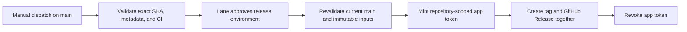

# Dedicated Release App Design

**Status:** Implemented and externally verified; first controlled publication succeeded
**Date:** 2026-08-22
**Issues:** #402 closed; #415 closed; #416 closed after first controlled Latest Release
**Decision authority:** `docs/decisions/remediation-guardrails.md`

## Outcome

Public `v*` tags and GitHub Releases will be created only by a repository-scoped GitHub App after the exact current `main` SHA passes the supported Python matrix and Lane approves the protected `release` environment. Humans, administrators, ordinary `GITHUB_TOKEN` jobs, and other apps receive no release-tag bypass.

This closes the gap exposed when GitHub rejected its built-in Actions integration as a tag-ruleset bypass actor for this personal repository. It preserves the existing rule that the tag and GitHub Release are created together by one controlled API call.

This trust boundary is implemented and externally verified. PR #433 merged at `05a1c7b55cccde92786918ab18ee85a6de2aa5cc`; `Protect main` (ID `21204190`) and `Protect release tags` (ID `21211977`) are active with their approved no-bypass and sole-App-bypass policies. Controlled run `32600568406` published immutable Latest Release `v1.5.35` from exact tested SHA `4b79513b6811c1884be42dadbb1d45f2354d70a6` after protected-environment approval; post-tag consistency run `32600637687` passed.

## Security requirements

- The app is installed only on `lanebecker/vinyl-now-playing`.
- The app has only repository `Contents: Read and write`; metadata read access is implicit. It has no organization permissions, account permissions, webhook, or subscribed events.
- The long-lived private key exists only in the GitHub `release` environment. It is never written into the repository, workspace, task, logs, shell history, or a general repository secret.
- The Client ID is stored as the non-secret `release` environment variable `RELEASE_APP_CLIENT_ID`.
- The private key is stored as the `release` environment secret `RELEASE_APP_PRIVATE_KEY`.
- The environment permits deployments only from `main`, requires Lane Becker (`lanebecker`, user ID `3211673`) as reviewer, and permits self-review so the sole owner can approve a release they dispatched.
- The workflow's ordinary `GITHUB_TOKEN` has `contents: read`, `actions: read`, and `checks: read`; it cannot publish.
- The app token explicitly requests only `contents: write`, is scoped to the current repository, is masked, expires within one hour, and is revoked automatically after its job.
- The API-verified `Protect release tags` ruleset targets `refs/tags/v*`, names the installed release app as its sole bypass actor in `always` mode, and restricts creation, deletion, and non-fast-forward updates. Humans, administrators, ordinary `GITHUB_TOKEN`, and other apps have no bypass.
- GitHub immutable releases remains enabled.

## External objects

### GitHub App

- **Name:** `vinyl-now-playing-release-lbecker`
- **App ID:** `4684884`
- **Client ID:** `Iv23lio63JQpLQKjuPyS`
- **Installation ID:** `155762263`
- **Owner:** `lanebecker`
- **Homepage:** `https://github.com/lanebecker/vinyl-now-playing`
- **Webhook:** inactive
- **Repository permissions:** Contents — Read and write
- **Subscribed events:** none
- **Installation scope:** Only select repositories → `vinyl-now-playing`

The app is not public and is not installed on any other repository.

### Release environment

- **Name:** `release`
- **Deployment branch policy:** selected branches only → `main`
- **Required reviewer:** `lanebecker`
- **Prevent self-review:** disabled
- **Variable:** `RELEASE_APP_CLIENT_ID`
- **Secret:** `RELEASE_APP_PRIVATE_KEY`

GitHub must withhold the environment secret until the required reviewer approves the job.

### Release-tag ruleset (active and API-verified)

- **Name:** `Protect release tags`
- **Target:** tags matching `refs/tags/v*`
- **Ruleset ID:** `21211977`
- **Current enforcement:** active; created only after PR #433 merged and exact-SHA post-merge checks passed
- **Bypass actors:** the installed `vinyl-now-playing-release-lbecker` app only, mode `always`
- **Rules:** restrict creation, restrict deletion, block non-fast-forward updates

`Protect main` (ruleset ID `21204190`) remains separate and retains no bypass actors.

## Workflow architecture

`.github/workflows/release.yml` is a two-job workflow.

### `validate` job

The job has no environment and cannot access release credentials. It:

1. Checks out the selected SHA with the read-only `GITHUB_TOKEN`.
2. Confirms the selected SHA is the current remote `main` SHA.
3. Runs `scripts/check_version_metadata.py`.
4. Refuses an existing tag or GitHub Release.
5. Fetches the exact-SHA `tests.yml` push run and check runs.
6. Runs `scripts/release_gate.py` for `test (3.11)`, `test (3.12)`, and `test (3.13)`.
7. Exposes only the validated version, tag, and SHA as job outputs.

### `publish` job

The job declares `needs: validate` and `environment: release`. It starts only after validation succeeds and Lane approves the environment. It:

1. Checks out the exact validated SHA.
2. Re-runs metadata validation and the existing-tag/existing-Release refusal after the approval wait.
3. Fetches remote `main` and fails if it differs from the validated SHA.
4. Uses `actions/create-github-app-token@bcd2ba49218906704ab6c1aa796996da409d3eb1` (`v3.2.0`) with `client-id`, `private-key`, and `permission-contents: write`. Omitting `owner` and `repositories` scopes the token to the current repository.
5. Uses only that step's token as `GH_TOKEN` for `gh release create`.
6. Creates the missing tag and GitHub Release in the same API operation, with the linked tested SHA and supported Python/Pi OS text.

The token action's post-step revokes the installation token. The workflow must not set `skip-token-revoke`.

## Failure and recovery behavior

All failures are pre-publication and fail closed unless GitHub's release API returns an ambiguous result.

| Failure | Required behavior |
|---|---|
| Validation, metadata, or matrix check fails | `publish` is never eligible for approval. |
| Approval is rejected or omitted | No credential is exposed and nothing is published. |
| Client ID, private key, or installation is invalid | Token creation fails before the release call. |
| App token lacks `contents: write` | Publication fails; do not widen permissions without revising this design. |
| `main` advances during approval or publication | Fail before the release call; dispatch again for the new SHA. |
| Tag or Release already exists | Fail; never overwrite, retag, or delete automatically. |
| Release API reports failure or times out | Query tag and Release state before retrying. Never retry an ambiguous creation blindly. |
| App private key is suspected compromised | Disable the tag ruleset bypass or app installation, generate a new key, replace the environment secret, verify token minting, then delete the old key. |

Rollback is non-destructive: disable the `Protect release tags` ruleset and the app installation, leaving existing immutable releases untouched. Do not restore manual tag pushing as a release mechanism.

## Implementation sequence

1. Create the GitHub App, generate one private key, and install it only on this repository.
2. Create the protected `release` environment and place the Client ID/private key there without exposing the key to the workspace.
3. Update the decision ledger with the app/environment identity and credential rules.
4. Add RED-first workflow-contract tests.
5. Split `release.yml` into `validate` and `publish`; pin the official token action to the resolved v3.2.0 commit.
6. Run focused tests, `actionlint`, metadata validation, and the supported CI matrix through a `codex/` branch and pull request.
7. Merge only after all checks pass.
8. Create the active `Protect release tags` ruleset using the installed app's numeric App ID as the sole bypass actor; read it back from the API.
9. Verify the `release` environment configuration, app installation scope, repository workflow permissions, immutable-release setting, and both rulesets.
10. On the next version, dispatch the controlled workflow, approve the environment only after validation succeeds, and confirm Latest Release, VERSION, newest tag, and linked tested SHA agree before closing #416.

## Test and acceptance plan

RED-first workflow-contract tests must demonstrate that the following mutations fail:

- restore `contents: write` to the ordinary `GITHUB_TOKEN`;
- place release secrets or the environment on the `validate` job;
- allow `publish` to run without `needs: validate` or `environment: release`;
- use `github.token` rather than the app token for `gh release create`;
- omit the post-approval metadata, existing-tag, or current-`main` recheck;
- broaden the app token beyond the current repository or beyond `contents: write`;
- use an unpinned token action or skip token revocation.

Before merge:

- all release-gate, metadata, CI-integrity, and workflow-integrity tests pass;
- all workflow files pass `actionlint`;
- `git diff --check` passes;
- the PR's Python 3.11/3.12/3.13 tests and dependency audits pass.

Verified after merge and post-merge checks:

- the app installation lists only `vinyl-now-playing`;
- the environment lists only `main`, Lane as reviewer, the Client ID variable, and the private-key secret;
- `Protect main` remains active with no bypass;
- the built-in `GITHUB_TOKEN` no longer has write permission in `release.yml`;

Verified after Task 7 creation and API readback:

- `Protect release tags` is active with only the release app bypass;

Verified after the first controlled publication:

- `v1.5.35` is one immutable tag and one GitHub Release for the same tested current-main SHA `4b79513b6811c1884be42dadbb1d45f2354d70a6`;
- the Release is Latest and its notes link the tested SHA and record supported Python/Pi OS versions;
- post-tag consistency run `32600637687` passed for that SHA.

## Deliberately rejected alternatives

- **Deploy key:** broader Git transport capability, awkward secret handling, and tag creation separated from Release creation.
- **Personal or bot PAT:** longer-lived user credential, weaker revocation boundary, and greater accidental reuse.
- **Admin/user tag bypass:** fails the requirement to prevent ad-hoc release tags.
- **Deletion/update protection without creation restriction:** leaves the audited pre-release tag-confusion path open.
- **Custom release service:** unnecessary infrastructure for a single-repository, low-frequency release path.

## Revisit triggers

Revisit this design if the repository moves to an organization with required-workflow controls, GitHub makes the built-in Actions integration eligible for a personal-repository tag bypass, the app must serve more repositories, or releases require signing/attestation beyond GitHub's immutable-release guarantee.
