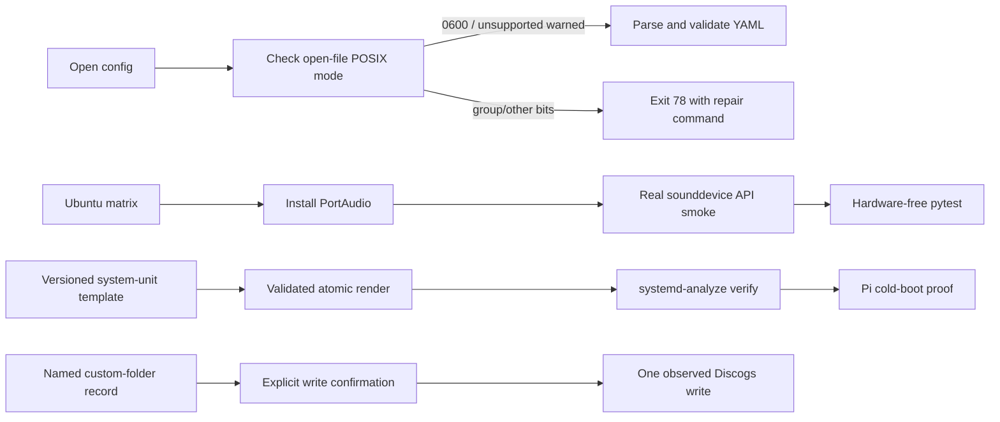

# Wave 1 Pi Preflight Design

**Status:** Approved for implementation; Pi-only acceptance remains pending
**Date:** 2026-08-22
**Issues:** #418, #156, #419, and carried hypothesis #366
**Decision authority:** `docs/decisions/remediation-guardrails.md`

## Outcome

Wave 1 turns the current manual first-boot guidance into enforceable software
boundaries without claiming that CI is a Raspberry Pi. Startup rejects an
overexposed POSIX credential file before parsing it, CI imports the real
`sounddevice` package and checks every production-used API before pytest can
stub it, the repository owns a parameterized system-service artifact and an
idempotent renderer, and the Discogs live-write probe requires an explicitly
chosen record and confirmation.

The wave is not complete until the target Pi proves the hardware/session gates:
`config.yaml` is `0600`, the UCA222 opens and survives unplug/replug, the system
service survives a cold boot into the selected display session, and the chosen
custom-folder Discogs record either accepts the folder-0 write or supplies the
404 evidence that activates the deferred folder-identity code change.

`DESIGN.md` is not authority for this work. Current tested behavior, the live
issue contracts, historical closure rationale, and the owner's ratified
decisions control.

## Decisions and invariants

### Credential-file security (#418)

- `load_config` opens the file and evaluates `os.fstat()` on that open file
  before reading or parsing any YAML, avoiding a check/open race.
- On POSIX, any group/other permission bit (`mode & 0o077`) raises
  `ConfigError`. The diagnostic names the path and exact `chmod 600 <path>`
  repair, but never includes file contents or credential values.
- On a platform that cannot provide POSIX mode semantics, startup logs one
  explicit warning and continues. The application does not silently chmod an
  operator-owned file.
- The checked-in example remains non-secret. The live `config.yaml` remains
  ignored, untracked, unread by automation, and `0600`.

### Real audio-backend CI boundary (#156)

- Each supported Ubuntu matrix leg installs the PortAudio runtime before Python
  dependencies.
- A standalone pre-pytest command imports the installed `sounddevice` module
  and requires callable `query_devices`, `InputStream`, `_terminate`, and
  `_initialize`, the complete production API surface in `src/audio/capture.py`.
- The ordinary unit suite remains hardware-free. Root `conftest.py` first tries
  the real import and installs its centrally-owned stub only if import fails;
  teardown removes only the stub it installed.
- Import/API success is not evidence of USB enumeration, callback timing,
  actual `InputStream` operation, or hot-plug recovery on the Pi.

### Versioned system-service deployment (#419)

- The supported architecture remains a **system service**. A user-service
  migration is out of scope even if it would simplify a particular Wayland
  session.
- `deploy/vinyl-now-playing.service.in` is the single unit source. It is
  parameterized for service user, absolute app directory, display, and absolute
  Xauthority/session-auth path.
- Rendering rejects unsafe values, requires the app directory and `config.yaml`
  to exist, requires the config to be `0600`, writes atomically, and never
  modifies config permissions. Re-rendering the same inputs is byte-identical.
- The unit preserves the already-shipped behavior from #83 and #201:
  `Wants=network-online.target`,
  `After=network-online.target time-sync.target graphical.target`,
  `StartLimitIntervalSec=300`, `StartLimitBurst=10`, `RestartSec=15`,
  `RestartPreventExitStatus=78`, and `TimeoutStopSec=30`.
- Linux CI renders a representative unit and runs `systemd-analyze verify`.
  The selected Raspberry Pi OS image still determines the correct live
  `DISPLAY`/Xauthority values, which must be recorded during bring-up.

### Safe Discogs live probe (#366)

- Read-only remains the default.
- The test artist and album are command-line inputs rather than source edits.
- A write requires `--test-write`, an explicit interactive confirmation that
  names the selected record and field, or `--yes` for an already-authorized
  noninteractive run. EOF, refusal, or a missing explicit record aborts before
  constructing or invoking the writer operation.
- The operator chooses a sacrificial or reversible record that is actually in a
  non-default folder and records the non-secret before/after result.
- A successful write closes #366 as a disproven hypothesis. A 404 activates a
  separate folder-ID propagation change across reader, metadata, session, and
  writer. Ambiguous write results are inspected before any retry.

## Architecture

## Failure and recovery behavior

| Failure | Required behavior |
|---|---|
| POSIX config exposes any group/other bits | Fail before YAML parsing; print only path and `chmod 600` repair. |
| POSIX mode cannot be evaluated | Warn once and continue to ordinary validation. |
| Real `sounddevice` import or required API is missing | CI leg fails before pytest; Pi startup remains parked at exit 78. |
| Unit input is unsafe or config is not `0600` | Renderer refuses to write the output unit. |
| Render/install is interrupted | Atomic replacement leaves either the prior complete unit or the new complete unit. |
| System service cannot open the live display | Preserve the system-service design; inspect and correct image-specific session auth, then rerun cold boot. |
| Discogs write is declined/unconfirmed | No write occurs. |
| Discogs write reports 404 | Preserve evidence, do not retry, and activate folder-ID propagation work. |
| Discogs write outcome is ambiguous | Query current field state before any retry. |

Rollback for the service is non-destructive: keep a copy of the last known-good
rendered unit, point the app directory/venv back to the last known-good release,
run `systemd-analyze verify`, then `daemon-reload` and restart. Never loosen
`config.yaml` permissions as a recovery step.

## Verification boundary

Software acceptance requires focused tests, the full supported Python
3.11/3.12/3.13 CI matrix, workflow lint, Linux unit verification, and clean
diff/security scans. Hardware acceptance requires the real Pi checklist and
non-secret evidence. The local macOS Python 3.9/sandbox suite is a recorded
unsupported baseline (16 known failures); it cannot replace the supported CI
matrix and does not block scoped RED/GREEN work.
