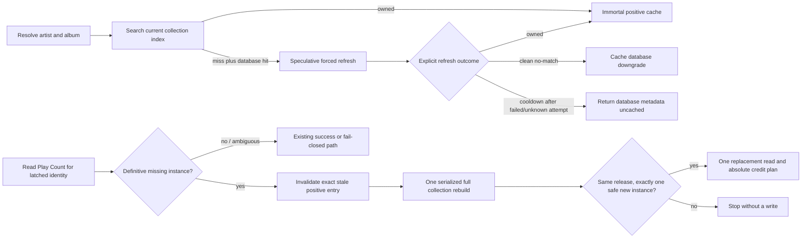

# Wave 2 Metadata Recovery and Cache Coherence Design

**Status:** Approved for planning and implementation
**Date:** 2026-08-22
**Issues:** #420 (R10-05) and #421 (R10-12)
**Decision authority:** `docs/decisions/remediation-guardrails.md`

## Outcome

Wave 2 makes Discogs ownership state explicit and permits one narrowly bounded
recovery when a previously valid collection instance has definitively
disappeared. It does not turn the 24/7 appliance into a continuously syncing
Discogs client, expire positive collection matches during ordinary reads, or
trade a missed credit for a possible wrong-record write.

The work lands in this order:

1. #420 distinguishes an owned result, a completed clean no-match, and a
   cooldown-skipped refresh. A skip or error that leaves ownership unknown may
   return database metadata for the current display, but may not cache that
   downgrade as if Discogs had proved the record unowned.
2. #421 recognizes a missing instance only after a complete, successful
   enumeration proves it absent. It then invalidates the exact stale positive
   cache entry, rebuilds collection ownership once, and retries the current
   Play Count credit once only if the same Discogs release resolves to exactly
   one eligible new collection instance.

`DESIGN.md` is not authority for this work. Current tested behavior, the live
issue contracts, historical closure rationale, and the owner's ratified
decisions control.

## Binding invariants

### Ownership and cache truth

- The collection index remains process-local and memory-only. #169's rejected
  persistence design is not reopened.
- Positive `DISCOGS_COLLECTION` resolver entries remain immortal during
  ordinary reads. There is no positive-entry TTL, background refresh, or
  periodic revalidation.
- The #191 15-minute speculative-refresh cooldown remains global and is stamped
  before network I/O, including a failed attempt. Temporary failure must not
  produce one full collection re-page per unowned album.
- Failed or incomplete collection-index builds have a separate bounded
  backoff. While it is active, ordinary resolution serves a prior complete
  snapshot only as stale/unknown or fails fast when none exists; it may not
  launch another page walk or authorize clean-negative caching. Recovery also
  fails fast and spends that session's one recovery budget. A successful
  complete rebuild clears this build-failure backoff.
- A failed index rebuild preserves the last complete index and propagates the
  error. #242 swap-on-success remains intact.
- A displayed database result is not necessarily cacheable. A database
  downgrade is cached only when the active collection state proves a completed,
  clean ownership check.

### Credit and write integrity

- A missed Discogs credit is preferable to a phantom, duplicate, or wrong-copy
  credit.
- Recovery begins only from a definitive missing-instance result during the
  read half, before a new absolute Play Count target is computed.
- An ambiguous POST outcome never triggers identity recovery or another
  read-modify-write. #186 remains: read once, compute one absolute target, and
  retry only that same absolute POST.
- The existing #229 bounded rate-limit behavior remains separate from the one
  identity-recovery budget. Neither path may recursively activate the other.
- Last Played retains the ratified META-7 independence from Play Count and its
  single-attempt absolute-write behavior. Once recovery establishes one safe
  replacement identity, Last Played uses that identity even if Play Count
  independently fails. If recovery cannot establish a safe identity, neither
  field targets the known-stale instance.
- Confirmation, session epoch, side coverage, spin deduplication, and
  `crediting`/`credited` gates are unchanged.

## Architecture



The reader remains responsible for Discogs collection enumeration and matching.
The resolver remains responsible for ownership interpretation and album-cache
coherence. The writer remains responsible for collection-field reads and
writes. The tracker receives one narrow recovery capability rather than the
reader or resolver as a general dependency.

## #420: explicit refresh outcomes

### Reader contract

`DiscogsReader.refresh_index_and_research()` no longer returns an ambiguous
`Optional[dict]`. It returns an immutable result with:

- `OWNED`: a validated collection match is present;
- `CLEAN_NO_MATCH`: a complete rebuild succeeded and produced no unambiguous
  owned match;
- `COOLDOWN_SKIPPED`: no rebuild was attempted because the global cooldown is
  active.

The result also records whether the active cooldown follows a successful full
collection rebuild. This provenance is false as soon as a new forced attempt is
stamped and becomes true only after that attempt has successfully completed the
full collection rebuild. Exceptions remain exceptions; transport, parsing, and
index-build failures are never converted to a result state.

A rebuild is complete only when pagination metadata is present and valid, every
advertised collection page finishes successfully, returned page metadata stays
internally consistent, all required item identities validate, and the final
page is reached below the defensive cap. Missing/malformed pagination or
reaching the cap while another page is advertised is an unknown/error outcome:
the partial candidate index is discarded, the prior complete index is restored
under #242, and the result may not be `CLEAN_NO_MATCH` or authorize downgrade
caching. This strict rule applies to any rebuild that would replace the active
index; an incomplete index is never promoted as complete truth.

Every failed/incomplete ordinary, speculative, or recovery rebuild stamps the
separate build-failure backoff before returning or raising. Repeated tracks
during that bounded window do not restart pagination. If a prior complete index
exists, positive matches may still be served from it under the ordinary
immortal-positive policy, but its misses are unknown and cannot authorize a
database downgrade. If no complete index exists, collection ownership remains
unavailable and uncached until backoff expires. This backoff limits page-walk
frequency without changing the #191 speculative cooldown timestamp or recovery
budget.

On a cooldown skip:

- if the active cooldown follows a successful rebuild, the existing collection
  snapshot is authoritative enough to permit the normal database downgrade;
- if it follows a failed or otherwise incomplete attempt, ownership remains
  unknown and the database result is returned uncached.

The implementation may conservatively leave a downgrade uncached when it
cannot prove successful-refresh provenance. It may never infer clean ownership
from elapsed time, a truthy database result, or the mere presence of a stale
index.

### Resolver contract

The resolver branches on the explicit state, never result truthiness:

| Refresh outcome | Display result | Album-cache action |
|---|---|---|
| `OWNED` | Collection metadata | Store immortal positive result |
| `CLEAN_NO_MATCH` | Database metadata | Store existing one-hour downgrade |
| `COOLDOWN_SKIPPED`, prior rebuild proven successful | Database metadata | May store existing one-hour downgrade |
| `COOLDOWN_SKIPPED`, prior attempt failed/unknown | Database metadata | Do not cache |
| Exception | Best available metadata/fallback | Do not cache a Discogs downgrade |

This preserves both user-visible metadata availability and truthful retry
behavior.

## #421: definitive instance recovery

### Public writer result

`read_play_count()` gains an explicit result status rather than overloading
`None` for every abort condition:

- `READY`, with validated `field_id` and current integer count;
- `DEFINITIVE_INSTANCE_MISSING`, carrying the complete validated tuple of
  currently observed instance IDs for the requested release;
- `ABORT`, for every other unsafe condition.

The existing confirmed-blank field remains `READY` with count zero. Missing
field configuration, non-integer owner data, malformed JSON, incomplete
pagination, non-success HTTP status, transport error, and unknown response
shape remain `ABORT` and authorize no write or recovery.

### Proof required for “definitive”

The collection-items-by-release response may contain multiple copies and may be
paginated. Because Discogs supplies no snapshot token, traversing multiple
pages while the collection changes cannot prove that an omitted item was absent
from one coherent snapshot. Absence is therefore definitive only when all of
the following are true:

1. every request completed successfully with a parseable `200` response;
2. pagination metadata is present, internally consistent, and proves the whole
   result is page 1 of exactly 1 page;
3. pagination `items` equals the number of returned release items and the
   positive `per_page` value can contain that count;
4. every item identifies the requested positive `release_id`, and every
   `instance_id` is a unique positive integer; and
5. the expected instance is absent from that validated complete set.

An undocumented `404`, any `pages > 1` response, a one-page body without
complete pagination proof, duplicate/malformed identities, or a body that
merely omits the expected instance is not definitive. These remain `ABORT`
until a separately reviewed contract or executed live evidence proves a
stronger interpretation. Raw Discogs response bodies and credentials are never
logged.

### Latched recovery identity

`PlaySession` stores `album_resolve_key` at the exact moment it first latches
`album_release_id` and `album_instance_id`. It uses that track's original,
normalized resolver key; it does not reconstruct identity from a decorated
Discogs title or use `last_release_resolve_key`, which can later change.

Recovery requires:

- a non-empty latched resolver key;
- exact positive-integer expected release and instance IDs;
- a fresh, complete collection rebuild that unambiguously matches the expected
  release for that key;
- the writer-proven complete instance tuple containing exactly one eligible
  replacement;
- the same Discogs `release_id` as the stale identity; and
- exactly one eligible positive replacement `instance_id`, different from the
  stale instance.

Restricting the current credit to the same release prevents an automatic write
to a different pressing selected only by artist/album text. A recovery rebuild
that matches a different release leaves this key uncached; a later ordinary
resolve may establish that release under the normal rules, but the current
stale session is not credited. Broader cross-release recovery requires a new
owner decision and stronger identity evidence.

The ordinary collection index deliberately collapses duplicate copies of a
release to one first-seen instance. Recovery may not use that collapsed value
as identity or multiplicity proof. The writer's strict, single-page
collection-items-by-release read supplies the complete validated instance tuple
from the same response that proves the stale instance absent. The resolver's
recovery rebuild independently proves that the expected release remains the
fresh, unambiguous album match. Recovery is authorized only when the writer's
tuple contains exactly one eligible new instance and the reader resolves that
same release. Zero or multiple surviving/replacement copies refuse the current
credit; collection order never selects a write target.

### Narrow recovery port

The tracker receives an optional async callable shaped like:

```python
async def recover_collection_instance(
    resolve_key: tuple[str, str],
    expected_release_id: int,
    expected_instance_id: int,
    observed_instance_ids: tuple[int, ...],
) -> CollectionIdentity | None: ...
```

`CollectionIdentity` contains validated release and instance IDs only. The
resolver implements the callable; reader result dictionaries and cache details
remain private to the metadata layer. A missing callback preserves current
fail-closed behavior and supports focused tracker tests.

### Conditional invalidation and rebuild

While holding the resolver's reader/cache gate, recovery:

1. inspects the cache entry for the key: an exact stale positive entry is
   removed; an absent entry requires no deletion and remains recoverable from
   the session's latched identity; a present nonmatching entry is never erased;
2. validates the writer-proven `observed_instance_ids` as a unique positive
   tuple that excludes the stale instance, then invokes a distinct recovery
   refresh that bypasses the speculative cooldown while retaining
   swap-on-success, strict pagination completeness, and all normal
   release-level album-matching safeguards;
3. stores a fresh positive result for future resolves only when the
   writer-proven tuple contains exactly one eligible instance and the fresh
   reader match has the expected release ID; it replaces any collapsed
   `instance_id` in the reader payload with that proven singleton; zero or
   multiple instances leave the key uncached; and
4. returns an identity only when the same-release/exactly-one-new-instance rules
   pass.

If another task has already replaced the cache entry, recovery must not erase
it. It may use that newer entry only when its exact release/instance pair equals
the writer-proven singleton replacement; otherwise it stops. An LRU-evicted or
otherwise absent key does not block the one serialized fresh recovery because
there is no newer cache value to overwrite.

If rebuilding fails, the reader retains its prior complete index under #242,
but the resolver does not restore the known-stale positive album-cache entry.
The failed session remains uncredited and a later recognition can resolve
again.

The recovery rebuild does not consume, reset, or extend the #191 speculative
refresh cooldown and does not change its success provenance. Even after a
successful recovery rebuild, an active cooldown left by a failed speculative
attempt remains conservatively uncacheable until the speculative state itself
changes. Recovery's positive result may still populate the exact positive
album entry only when the writer-proven multiplicity tuple contains exactly one
eligible instance. Recovery failure does stamp the separate build-failure
backoff.

## Serialization and concurrency

Today the mutable reader is safe because track commits are its only caller.
Recovery adds a finalizer caller, so the resolver owns one `asyncio.Lock` that
serializes every reader sequence, including ordinary collection/database
resolution, speculative refresh, and recovery refresh.

Ordinary resolve performs a cache check before the lock for the fast path and
rechecks after acquiring the lock before entering the reader. Recovery performs
its expected-identity check and conditional invalidation while holding the same
gate. No tracker lifecycle lock is held while waiting for Discogs I/O.

The tracker's existing finalize lock continues to serialize album finalization;
it is not repurposed as a reader lock. The shared Discogs executor remains the
transport boundary, but executor serialization is not treated as cache-state
coordination.

## Recovery credit sequence

When the first Play Count read returns `DEFINITIVE_INSTANCE_MISSING`:

1. spend the session's single identity-recovery budget;
2. call the recovery port with the latched key, exact stale pair, and complete
   validated instance tuple carried by the missing result;
3. stop if no safe identity is returned;
4. update only the detached session's album release/instance identity;
5. read the replacement instance once and compute one new absolute target;
6. use the existing bounded absolute-POST retry behavior;
7. mark the session credited and update spin memory only after the Play Count
   write succeeds; and
8. preserve META-7 independence by attempting Last Played once against the safe
   recovered pair, whether or not Play Count independently succeeds.

A second definitive-missing result stops both field writes because the recovered
target is no longer safe. An ambiguous replacement Play Count read aborts the
count but preserves META-7's independent single Last Played attempt against the
already established safe replacement identity. A transport/rate-limit exception
follows the existing bounded read behavior but does not replenish the
identity-recovery budget. Recovery never resumes a possibly applied old-instance
POST because it is available only before the old absolute target exists.

## Failure behavior

| Failure or uncertainty | Required behavior |
|---|---|
| Forced refresh raises | Preserve prior reader index; mark cooldown provenance unsuccessful; do not cache downgrade. |
| Index build is incomplete, malformed, or reaches its page cap | Discard the candidate, preserve any prior complete index as stale/unknown, stamp build-failure backoff, and do not page again during that window. |
| Cooldown follows failed refresh | Return display metadata uncached; make no additional collection-page request. |
| Complete refresh proves no ownership | Cache the normal database downgrade. |
| Collection response omits instance without complete pagination proof | `ABORT`; no write, invalidation, refresh, or retry. |
| Strict single-page enumeration proves instance missing | Permit the one conditional recovery attempt. |
| Release lookup advertises multiple pages or inconsistent identities | `ABORT`; absence is not snapshot-safe and authorizes no recovery. |
| Cache entry no longer matches expected stale pair | Do not erase it; accept only if independently safe, otherwise stop. |
| Cache entry is absent | Delete nothing; permit the one serialized fresh recovery from the latched identity. |
| Recovery returns no/ambiguous/different release or duplicate same-release copies | Keep current session uncredited; no Play Count or Last Played write. |
| Recovery sees zero or multiple eligible instances | Leave the album key uncached; never store a collapsed first-seen write target. |
| Replacement Play Count read is ambiguous/unsafe | Abort Play Count and do not initiate a second recovery; preserve one META-7 Last Played attempt against the established safe identity. |
| Replacement read definitively proves the new instance missing | Stop both field writes; do not initiate a second recovery. |
| Replacement absolute POST is ambiguous | Retry only the same absolute target under existing bounds. |
| Recovery rebuild fails | Keep reader's last complete index, leave stale album entry invalidated, and stop this credit. |

Every recovery refusal produces an actionable, non-secret log identifying the
stage and numeric release/instance IDs where safe. It does not log raw response
bodies, custom-field contents, access tokens, or configuration values.

## Test and acceptance plan

One shared table-driven state matrix covers:

- record added after long uptime;
- clean unowned miss;
- successful refresh with no owned match;
- successful refresh with an owned upgrade;
- forced-refresh error with old-index restoration;
- cooldown skip following failure;
- cooldown skip following successful rebuild;
- immortal positive cache under ordinary reads beyond downgrade TTL;
- complete enumeration of a removed/replaced instance;
- incomplete, malformed, multi-page, non-200, duplicate-ID, wrong-release, and
  transport-ambiguous reads;
- missing-instance results carrying the exact validated replacement tuple and
  no tuple escaping from an ambiguous read;
- same-release/new-instance recovery;
- same instance, changed release, duplicate instances of the same release, and
  no-match refusal;
- incomplete collection-index pagination and page-cap refusal without swapping
  out the prior complete index;
- repeated recognition after malformed/capped pagination making no second page
  walk during the build-failure backoff, both with and without a prior index;
- recovery during an active failed-attempt cooldown without changing its stamp
  or cacheability provenance;
- recovery after LRU eviction of the stale positive album entry;
- duplicate-instance recovery leaving the album key uncached for the next play;
- concurrent ordinary resolve and finalizer recovery;
- replacement read failure and second-missing refusal;
- ambiguous absolute POST retaining one computed target; and
- META-7 Last Played independence on the safe recovered identity, plus no Last
  Played write when recovery never establishes a safe target.

Behavior changes are implemented RED-first. Focused verification includes:

- `tests/test_cache_expiry.py`
- `tests/test_resolver.py`
- `tests/test_resolver_error_no_cache.py`
- `tests/test_discogs_collection_index.py`
- writer-focused Discogs tests
- `tests/test_credit_idempotent_186.py`
- `tests/test_listen_tracker.py`
- `tests/test_listen_tracker_conc2.py`
- `tests/test_finalize_retry_after.py`

Before merge, run the full supported Python 3.11/3.12/3.13 matrix and dependency
audit. The acceptance record must include the executed #420 failure-then-skip
reproduction and the #421 stale-instance-to-safe-replacement integration test.
No live Discogs write is required for unit acceptance; any later live diagnostic
remains read-only unless separately authorized under the #366 controls.

## Implementation sequence

1. Add RED tests for #420's explicit refresh states and cacheability matrix.
2. Implement the reader result and resolver branching without changing cooldown
   or swap-on-success behavior.
3. Verify and commit #420 independently.
4. Add RED tests for complete enumeration and the public writer read outcome.
5. Implement strict single-page definitive-missing proof while keeping all
   multi-page or malformed ambiguity fail-closed.
6. Add the latched resolve key, resolver gate, conditional invalidation, and
   narrow recovery port with concurrency tests.
7. Add the tracker single-recovery sequence and no-double-credit tests.
8. Run focused and integrated suites, then an adversarial review aimed at
   cooldown abuse, incomplete-pagination promotion, cache races, duplicate-copy
   or wrong-release targeting, nested retries, and Last Played drift.
9. Run supported CI, update durable guardrails/changelog/issue evidence, and
   close #420/#421 only after exact-SHA verification succeeds.

## Deliberately rejected alternatives

- **Positive-cache TTL or background synchronization:** conflicts with the
  owner's immortal-positive-read decision, adds recurring Discogs load, and can
  still race writes.
- **Inject the reader/resolver as a general tracker dependency:** recreates a
  metadata backchannel and weakens the deliberate A-4 read/write split.
- **Make the writer mutate resolver caches or rebuild collection search state:**
  combines unrelated responsibilities into a Discogs god object.
- **Treat any 404 or missing item in one `200` page as definitive:** converts an
  undocumented or incomplete response into authorization for a different
  write target.
- **Retry the whole old read-modify-write after a write failure:** reopens the
  #186 double-credit defect.
- **Persist the collection index or an instance mapping:** reopens #169 without
  a restart-safe removal/re-add design.

## Revisit triggers

Revisit this design if Discogs publishes and live evidence confirms a stronger
single-instance existence contract, if same-release replacements are
insufficient for real collection workflows, if measured reader serialization
hurts recognition latency, or if the owner reopens persistent collection state.
